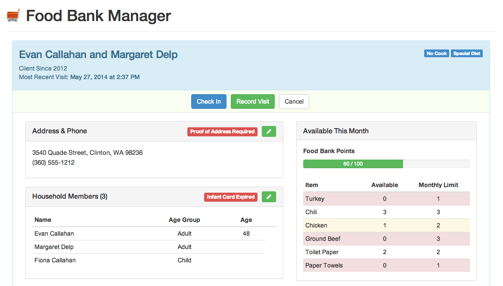

salesforce-food-bank
====================

Food Bank Service built on Salesforce using Angular.js

This is a Salesforce.com and AngularJS application that tracks clients and service delivery for food banks.



## Intro Video

Here is a 5-minute video introduction: http://youtu.be/vzvGtpBY08E

## Getting Started

 * **Visual Studio Code Setup**
 
    https://github.com/forcedotcom/salesforcedx-vscode 
 
 * **Bower Setup**
 
    ```
    In Visual Studio Code:
      - Install the Bower Extension
      - Ctrl+Shift+P -> Bower - Search and Install.  This will find the resource-bundles\Angular.resource\bower.json for dependencies to install.
    ```

 * **Cumulus CI Setup**
 
    https://github.com/SalesforceFoundation/CumulusCI

 * **Deploy to Scratch Org**

    ```
    cci deploy run task
    ```
     
 * **Open Scratch Org**

    ```
    sfdx force:org:open
    ```

 * **Salesforce Instance Setup**

    ```
    Edit System Administrator Profile > Field-Level Security for custom objects Client, Client Household, and Food Bank Visit & give View/Edit permissions on all fields
    ```

 * **Open Food Bank App**

    ```
    [instanceURL]/apex/FoodBankApp (FoodBankApp Visualforce Page)
    ```

## Running and Testing Locally

The Food Bank app has a mock data service that lets you test without connecting to Force.com.
There is an alternate home page, as well as a Jasmine Test Runner page.  For example, on a Mac:

 * Open a Terminal window to the food bank application root and type the following:

    - cd resource-bundles/Angular.resource

    - python -m SimpleHTTPServer

 * For the home page, open your web browser to: http://localhost:8000/
 * For the test runner, open to: http://localhost:8000/test/TestRunner.html


## Implementation Notes

This unmanaged package is built on 3 primary custom objects; Client, Client Household, and Food Bank Visit.  There is no dependency or integration with Salesforce NPSP (https://github.com/SalesforceFoundation/Cumulus) although that is a future goal.

## Description of Files and Directories  

* **orgs**: Directory that contains the scratch org definitions initially built by Cumulus CI. You reference these files when you create your scratch org with the 'cci org' or 'sfdx force:org:create' commands.
* **resource-bundles**: Directory that contains the source for the static resources and supports local testing framework.  NOTE: When making changes to these files if they are used in Salesforce then you need to zip the contents of Angular.resource\ directory and replace src\staticresources\Angular.resource followed by a 'cci task run deploy' to get the staticresources uploaded to Salesforce.  
* **src**: Directory that contains the source for the Food Bank app and tests.   
* **cumulusci.yml**:  Required by Cumulus CI.  Defines the deploy task. 
* **sfdx-project.json**: Required by Salesforce DX. Configures your project.  Use this file to specify the parameters that affect your Salesforce development project.
* **.forceignore**:  Optional SFDX file. Specifies files excluded when syncing and converting between scratch orgs and sfdx project.
* **.gitignore**:  Optional Git file. Specifies intentionally untracked files that you want Git (or in this case GitHub) to ignore.
* **.project**:  Required by the Eclipse IDE.  Describes the Eclipse project. 

 ## Issues

Please log issues related to this repository [here](https://github.com/groundwired/salesforce-food-bank/issues).